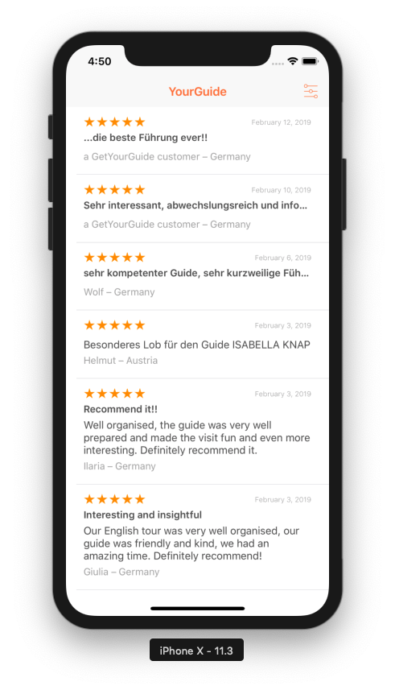
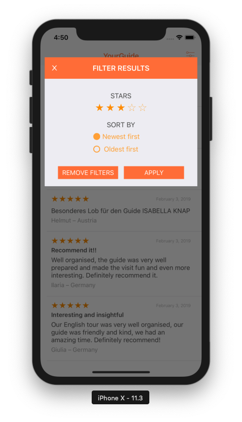

# YourGuide

This is an MVVM implementation of an app in which you can visualize user reviews about a Berlin tour.

It uses Cocoapods for dependency management. The dependencies are the following:

 - **Alamofire** for network requests
 - **Marshal** for converting network results into models
 - **Kingfisher** for presenting and handling the display and caching of images
 - **Swinject** and **SwinjectStoryboard** for dependency injection
 - **Cosmos** for rating stars

Some features included are:
- Infinite scroll
- Filtering reviews by number of stars
- Filtering reviews by date (Newest first/ Oldest first)
- Combination of both

  

Some screenshots:

